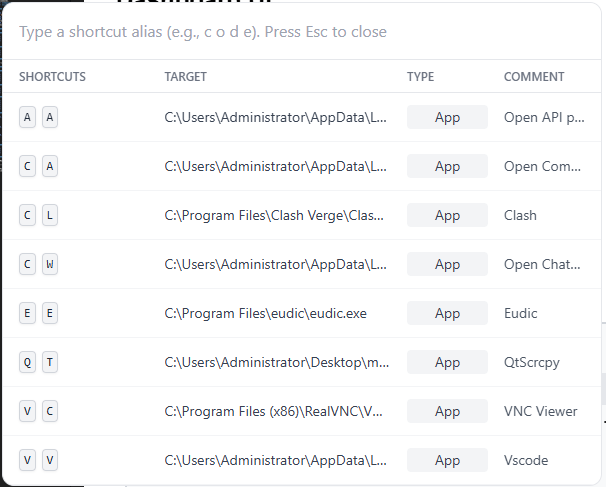

<p align="center">

</p>
<h1 align='center'> AliasLauncher (CA) </h1>

<p align="center">
    <a href="https://github.com/wuchuheng/command-alias/actions/workflows/release.yml">
        
    </a>
    <a href="https://opensource.org/licenses/MIT">
        
    </a>
</p>

AliasLauncher is a cross-platform keyboard shortcut launcher inspired by macOS's CommandAlias. It enables users to configure custom keyboard aliases to rapidly launch applications, execute commands, and streamline workflows on Windows, macOS, and Linux.

## Features

- **Key Alias Binding**: Map custom keyboard aliases to applications or commands.
- **Cross-Platform Support**: Works on Windows, macOS, and Linux.
- **Real-Time Feedback**: Visual indication during key alias entry.
- **Dashboard UI**: Manage all key bindings, application paths, prefix key, activation delay, and comments.
- **Performance Optimization**: Low-latency execution of bound commands.
- **Import/Export**: Manage key bindings via JSON files.
- **Light/Dark Theme**: Selectable UI theme.

## How It Works

1. **Trigger**: Hold the configurable prefix key (default: `ctrl` + `Space`) for the activation delay (default: 500ms).
2. **Input**: Enter the bound key alias.
3. **Visual Feedback**: Dialog UI shows matching commands in real-time.
4. **Execution**: System launches the selected application or executes the command.

## User Interfaces

### Dashboard UI

- Central management hub for key bindings and settings.
- Tabular view for CRUD operations on bindings.
- Settings apply immediately and auto-save to database.

### Notice UI

- Minimalist overlay for command selection.
- Real-time filtering as user types alias.
- Displays matches and executes on completion.

#### Example Trigger Panel



## Data Model

### KeyBinding Entity

- `alias`: Formatted as "c o d e"
- `actionType`: 'launch-app' | 'run-command' | 'execute-script'
- `target`: Path or command
- `comment`: Optional description

### AppConfig Entity

- `prefixKey`: Activation key (default: Space)
- `activationDelay`: Delay in ms (default: 500)
- `uiTheme`: 'light' or 'dark'

## Architecture

- **Renderer**: React + TypeScript + Tailwind CSS
- **Main**: Electron + Node.js
- **Database**: SQLite via TypeORM
- **IPC**: Strictly typed channels for communication
- **Services**: Business logic for key binding operations

## Getting Started

1. Clone the repository:
   ```bash
   git clone https://github.com/wuchuheng/command-alias.git
   cd command-alias
   ```
2. Install dependencies:
   ```bash
   npm install
   ```
3. Run the application:
   ```bash
   npm run start
   ```

## Configuration

- Set prefix key and activation delay in the dashboard UI.
- Add, edit, or delete key bindings.
- Import/export bindings via JSON.

## License

MIT

---

For detailed design and implementation, see [SOFTWARE_DESIGN.md](SOFTWARE_DESIGN.md).
